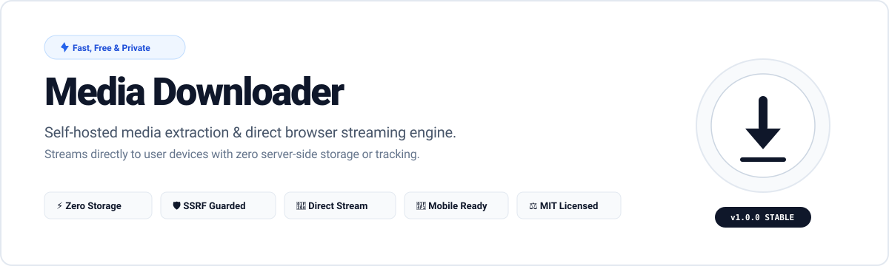
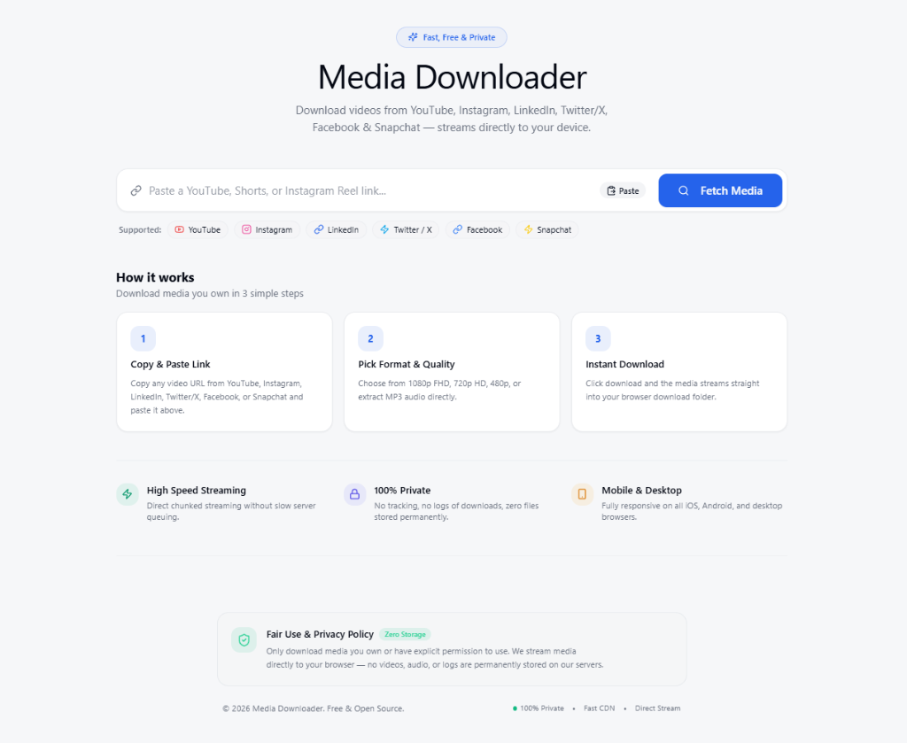

<div align="center">

  

  <br/><br/>

  <h1>Media Downloader</h1>

  <p><strong>A clean, self-hosted media extraction and direct browser streaming web application.</strong></p>
  <p>Download public media you own from YouTube, Shorts, and Instagram Reels — streamed directly to your browser with zero server-side storage.</p>

  <p>
    <a href="LICENSE"></a>
    <a href="#"></a>
    <a href="#"></a>
    <a href="#"></a>
    <a href="#"></a>
    <a href="#"></a>
    <a href="CONTRIBUTING.md"></a>
  </p>

  <p>
    <a href="#-features">Features</a> •
    <a href="#-how-it-works">How It Works</a> •
    <a href="#-platform-support">Supported Platforms</a> •
    <a href="#-quick-start">Quick Start</a> •
    <a href="#-api-documentation">API Docs</a> •
    <a href="#-license">License</a>
  </p>

</div>

---

## 📸 Application Preview

<div align="center">
  
</div>

---

## ⚡ How It Works

Download media you own in 3 simple steps:

| Step | Action | Description |
|:---:|---|---|
| **`1`** | **Copy & Paste Link** | Paste any supported public video or reel URL into the search box. |
| **`2`** | **Pick Format & Quality** | Choose from available resolutions (1080p FHD, 720p HD, 480p) or extract audio directly (MP3 / M4A). |
| **`3`** | **Instant Download** | Click download to stream the media straight into your browser's download folder. |

---

## 🌟 Key Highlights

- **⚡ High Speed Streaming:** Direct chunked streaming proxy — files stream into the browser as they arrive, eliminating long server processing queues.
- **🔒 100% Private & Ephemeral:** Zero persistent storage on the host server. No databases, no user tracking, and no permanent media archives.
- **🛡️ Strict SSRF Protection:** Validates every incoming URL against allowed domains; blocks loopback addresses, localhosts, and private subnet ranges.
- **📱 Fully Responsive:** Clean white-slate minimalist interface optimized across desktop, tablet, and mobile browsers.
- **🐳 Multi-Platform Setup:** Ready to run via native PowerShell script, manual terminal commands, or containerized Docker Compose.

---

## 🌐 Platform Support

| Platform | Content Type | Video Quality | Audio Extraction | Streaming Mode | Status |
|---|---|:---:|:---:|:---:|:---:|
| **YouTube** | Videos & Uploads | Up to 4K / 1080p | ✅ MP3 / M4A | Direct Chunked | 🟢 Supported |
| **YouTube Shorts** | Shorts & Embeds | HD (1080p) | ✅ MP3 / M4A | Direct Chunked | 🟢 Supported |
| **Instagram** | Public Reels | HD Video | ✅ Audio Track | Direct Stream | 🟢 Supported |
| **Direct Links** | Shareable `/download?url=...` | Dynamic | Dynamic | Browser Prompt | 🟢 Supported |

> **Fair Use Notice:** Only download content you own or have explicit authorization to download. This tool operates strictly with publicly accessible content and does not bypass DRM, paywalls, or private authentication.

---

## 🏗️ Architecture

```text
Browser Client ──────► Next.js 14 UI ──────► FastAPI Backend ──────► yt-dlp / Sources
      ▲                                                                    │
      └────────────────── Streamed Chunks (No Disk Storage) ───────────────┘
```

The FastAPI backend parses metadata and formats via `yt-dlp`. For streamable files, it forwards the media stream in chunks directly to the client with `Content-Disposition: attachment`. If merging is required, a temporary working buffer is used and purged immediately once the response concludes.

---

## 🚀 Quick Start

### Prerequisites
- **Node.js** 20+ and **npm**
- **Python** 3.12+
- **FFmpeg** (recommended for video/audio merging)
- *Optional:* Docker Desktop

### 1. Windows (PowerShell - One Command)
```powershell
Copy-Item .env.example .env
.\start-dev.ps1
```
*Automatically sets up Python virtualenv, installs dependencies, and launches both frontend (`:3000`) and backend (`:8000`).*

### 2. Docker Compose
```bash
cp .env.example .env
docker compose up --build
```
*Visit `http://localhost:3000` to start using the app.*

### 3. Manual Setup (macOS / Linux)

**Backend:**
```bash
cp .env.example .env
cd backend
python3 -m venv .venv
source .venv/bin/activate
pip install -r requirements.txt
uvicorn app.main:app --reload --port 8000
```

**Frontend:**
```bash
cd frontend
npm ci
npm run dev
```

---

## 🔌 API Documentation

When the backend is running, interactive OpenAPI documentation is available at `http://localhost:8000/api/docs`.

| Method | Endpoint | Description | Request Example |
|:---:|---|---|---|
| `GET` | `/api/v1/health` | Health and readiness check | `curl http://localhost:8000/api/v1/health` |
| `POST` | `/api/v1/media/info` | Fetch video info & available formats | `{"url": "https://www.youtube.com/watch?v=..."}` |
| `POST` | `/api/v1/media/download` | Stream selected media file | `{"url": "...", "format_id": "18"}` |
| `GET` | `/api/v1/media/download` | Direct browser download URL | `/api/v1/media/download?url=...&format_id=18` |

---

## ⚙️ Configuration

Copy `.env.example` to `.env` to customize runtime settings:

| Variable | Default | Purpose |
|---|---|---|
| `CORS_ORIGINS` | `http://localhost:3000` | Allowed origins (use real frontend domain in production). |
| `NEXT_PUBLIC_API_URL` | `http://localhost:8000` | Backend API URL embedded into frontend requests. |
| `MAX_DOWNLOAD_BYTES` | `10737418240` (10 GB) | Maximum allowed file size for streamed downloads. |
| `MAX_DURATION_SECONDS`| `14400` (4 hours) | Maximum allowable video duration. |
| `RATE_LIMIT_INFO_PER_MIN` | `60` | Per-IP rate limit for metadata extraction. |
| `RATE_LIMIT_DOWNLOAD_PER_MIN` | `30` | Per-IP rate limit for download streams. |
| `REQUEST_TIMEOUT_SECONDS` | `1800` (30 min) | Socket timeout for large stream handling. |
| `POT_PROVIDER_URL` | `http://127.0.0.1:4416` | Internal PO-token provider service. |

---

## 🧪 Testing & Code Quality

Run backend unit and security tests:
```bash
cd backend
python -m pytest tests -q
```

Run frontend typechecking and linting:
```bash
cd frontend
npm run typecheck
npm run lint
npm run build
```

---

## 🗺️ Roadmap & Ideas for Contributors

Looking for a way to contribute? Here are features planned for upcoming releases:

- [ ] **Dark Mode Support:** Theme toggle for night-time browsing.
- [ ] **Playlist Downloads:** Batch fetch and download entire playlists.
- [ ] **Progress & Speed Indicator:** Live download bandwidth & ETA display.
- [ ] **More Extractors:** Expand supported platforms (TikTok, Twitter/X videos, Pinterest).
- [ ] **Audio Formats:** Direct transcoding options for WAV, FLAC, and AAC.
- [ ] **Browser Extension:** One-click download button directly on supported web pages.

If you would like to work on any of these, feel free to open an issue or submit a pull request!

---

## 🤝 Contributing

Contributions are what make the open source community such an amazing place to learn, inspire, and create. Any contributions you make are **greatly appreciated**.

1. **Fork the Project**
2. **Create your Feature Branch** (`git checkout -b feature/AmazingFeature`)
3. **Commit your Changes** (`git commit -m 'feat: add AmazingFeature'`)
4. **Push to the Branch** (`git push origin feature/AmazingFeature`)
5. **Open a Pull Request**

Please review [CONTRIBUTING.md](CONTRIBUTING.md) and [CODE_OF_CONDUCT.md](CODE_OF_CONDUCT.md) for contribution guidelines.

---

## ⭐ Show Your Support

If this project helped you or saved you time, please give it a **Star on GitHub**! It helps more developers discover the repository.

---

## 📜 License

Distributed under the **MIT License**. See [`LICENSE`](LICENSE) for complete details.

